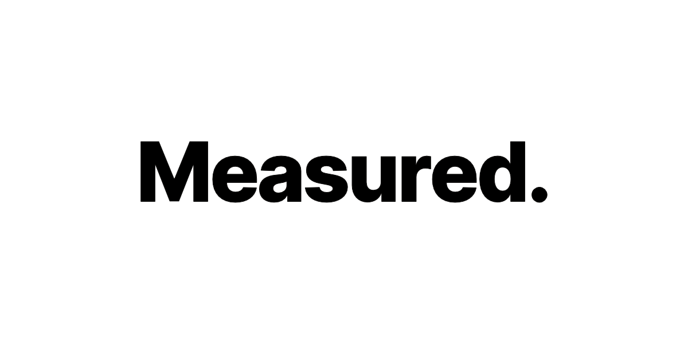

import { Cards } from "nextra/components";

# Showcase

A showcase of projects powered by Puck

<Cards className={"cards"}>
  <ShowcaseCard title="Measured Co" href="https://measured.co/">
    <></>
  </ShowcaseCard>
</Cards>

export const ShowcaseCard = Object.assign(
  // Copy card component and add default props
  Cards.Card.bind(),
  {
    displayName: "ShowcaseCard",
    defaultProps: {
      image: true,
      arrow: true,
      target: "_blank",
    },
  }
);

### Do you have a Puck powered project?

If you have a Puck powered project that you would like to have listed here, please raise a [PR on Github](https://github.com/measuredco/puck/tree/main/apps/docs/pages/showcase.mdx).
